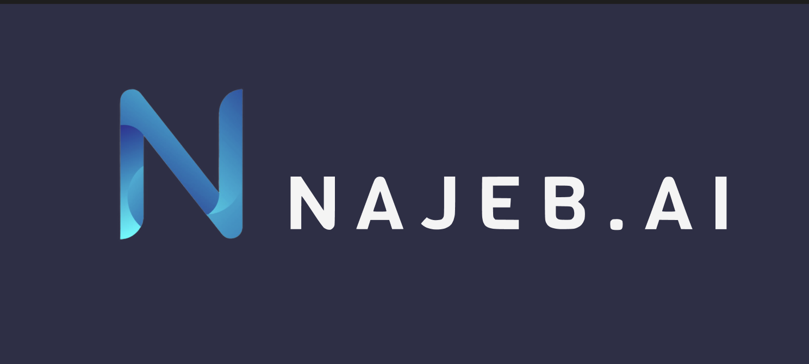

# Najeeb-AI ✨֎

# Description

**_Najeeb_** is a platform designed to assist health insurance companies in processing and auditing medical service requests from hospitals and other healthcare providers. By leveraging AI, Najeeb can detect potential fraud and suspicious activities in real-time. The platform also supports the submission of follow-up requests for previously filed claims, enhancing efficiency and accuracy. Additionally, Najeeb integrates an AI assistant to help doctors assess requests, offering recommendations and enabling seamless communication through a built-in chat feature.

## Responsibilites

- Led backend development for Najeeb, a revolutionary platform dedicated to optimizing health insurance claim processing and auditing.

- Integrated backend with AI algorithms to scrutinize medical service requests, identifying potential fraud or suspicious activities within claims submitted by hospitals and medical providers.

- Developed robust backend systems to facilitate seamless data exchange and communication between health
insurance companies and medical facilities

## Used Technologies

- NestJS.
- PostgreSQL.
- Prisma ORM.
